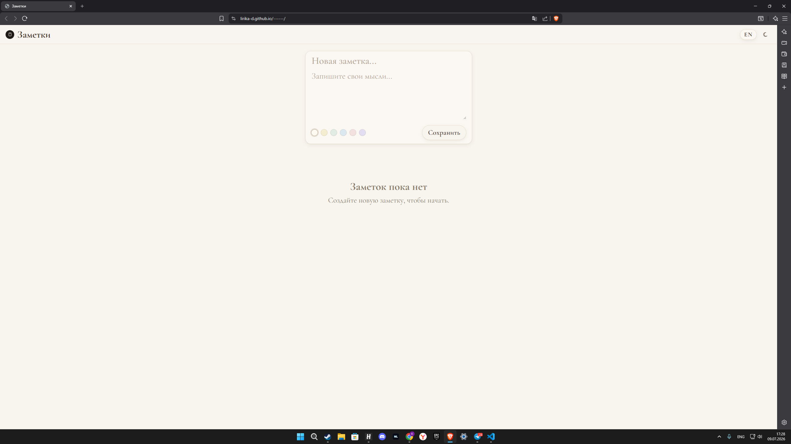

# Notes App

> 🇷🇺 Русская версия ниже / English version first.

------------------------------------------------------------------------

# 🇬🇧 English

## Overview

**Notes App** is a modern note-taking application built with **HTML**,
**CSS**, and **Vanilla JavaScript**. It provides a clean, responsive
interface for creating and managing notes directly in the browser
without any backend or external dependencies.

## Features

-   ✍️ Create, edit, and delete notes
-   🎨 Choose a color for each note
-   🌙 Light and dark themes with Material Design shadows on hover
-   🌍 English and Russian localization
-   💾 Automatic saving with Local Storage
-   ⏱ Relative timestamps
-   📱 Responsive layout for desktop and mobile
-   ✨ Smooth UI animations
-   🎯 Drag and drop to reorder notes (HTML5 Drag and Drop API)

## Technologies

-   HTML5
-   CSS3
-   JavaScript (ES6+)
-   Local Storage API

## Project Structure

``` text
.
├── index.html
├── style.css
├── script.js
└── README.md
```

## Getting Started

1.  Clone the repository.
2.  Open the project folder.
3.  Launch `index.html` in your browser.

No installation or build process is required.

## Data Storage

The application stores the following data in the browser using
**localStorage**:

-   Notes
-   Selected theme
-   Selected language
-   Custom note order (drag and drop)

## How to Use

### Creating a Note
1. Click on the title field and enter your note title
2. Click on the body field and write your content
3. Choose a color from the color palette (optional)
4. Click "Save Note"

### Editing a Note
1. Click the edit icon (pencil) on any note card
2. Modify the title and/or content
3. Change the color if needed
4. Click "Save Changes"

### Reordering Notes
1. Click and hold on any note card
2. Drag it over the note you want to swap with
3. Release to drop it in place
4. The order is automatically saved

### Deleting a Note
1. Click the delete icon (trash) on the note card
2. The note is removed with a smooth animation

## Future Improvements

-   Search functionality (UI ready, backend prepared)
-   Pin/unpin important notes
-   Tags and categories
-   Markdown support
-   Export / Import (JSON)
-   Cloud synchronization
-   Note sharing

------------------------------------------------------------------------

# 🇷🇺 Русский

## Описание

**Notes App** --- современное веб-приложение для создания и управления
заметками, разработанное с использованием **HTML**, **CSS** и **Vanilla
JavaScript**. Приложение работает полностью в браузере и не требует
сервера или дополнительных библиотек.

## Возможности

-   ✍️ Создание, редактирование и удаление заметок
-   🎨 Выбор цвета заметок
-   🌙 Светлая и тёмная темы с Material Design тенями при наведении
-   🌍 Поддержка русского и английского языков
-   💾 Автоматическое сохранение данных в Local Storage
-   ⏱ Отображение относительного времени изменения заметок
-   📱 Адаптивный интерфейс для компьютеров и мобильных устройств
-   ✨ Плавные анимации интерфейса
-   🎯 Перетаскивание для переупорядочивания заметок (HTML5 Drag and Drop API)

## Используемые технологии

-   HTML5
-   CSS3
-   JavaScript (ES6+)
-   Local Storage API

## Структура проекта

``` text
.
├── index.html
├── style.css
├── script.js
└── README.md
```

## Запуск проекта

1.  Склонируйте репозиторий.
2.  Откройте папку проекта.
3.  Запустите файл `index.html` в браузере.

Установка зависимостей и сборка проекта не требуются.

## Хранение данных

Все данные сохраняются локально в браузере с помощью **localStorage**:

-   заметки;
-   выбранная тема;
-   выбранный язык;
-   пользовательский порядок заметок (drag and drop).

## Как использовать

### Создание заметки
1. Нажмите на поле заголовка и введите название заметки
2. Нажмите на поле текста и напишите содержание
3. Выберите цвет из палитры (опционально)
4. Нажмите "Сохранить"

### Редактирование заметки
1. Нажмите на иконку редактирования (карандаш) на карточке заметки
2. Измените заголовок и/или содержание
3. Измените цвет при необходимости
4. Нажмите "Сохранить изменения"

### Переупорядочивание заметок
1. Нажмите и удерживайте карточку заметки
2. Перетащите её на заметку, с которой хотите поменяться местами
3. Отпустите для сброса на место
4. Порядок автоматически сохраняется

### Удаление заметки
1. Нажмите на иконку удаления (корзина) на карточке заметки
2. Заметка удаляется с плавной анимацией

## Возможные улучшения

-   Функция поиска (UI готов, логика подготовлена)
-   Закрепление/открепление важных заметок
-   Теги и категории
-   Поддержка Markdown
-   Экспорт и импорт (JSON)
-   Облачная синхронизация
-   Общий доступ к заметкам

## License / Лицензия

This project is intended for educational and personal use.

Проект предназначен для учебного и личного использования.
